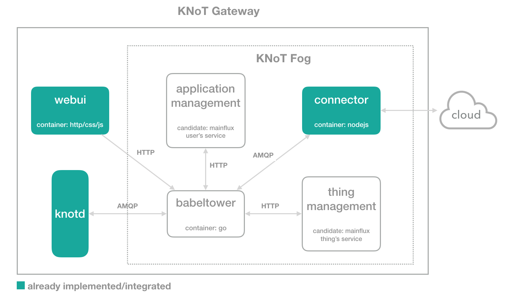
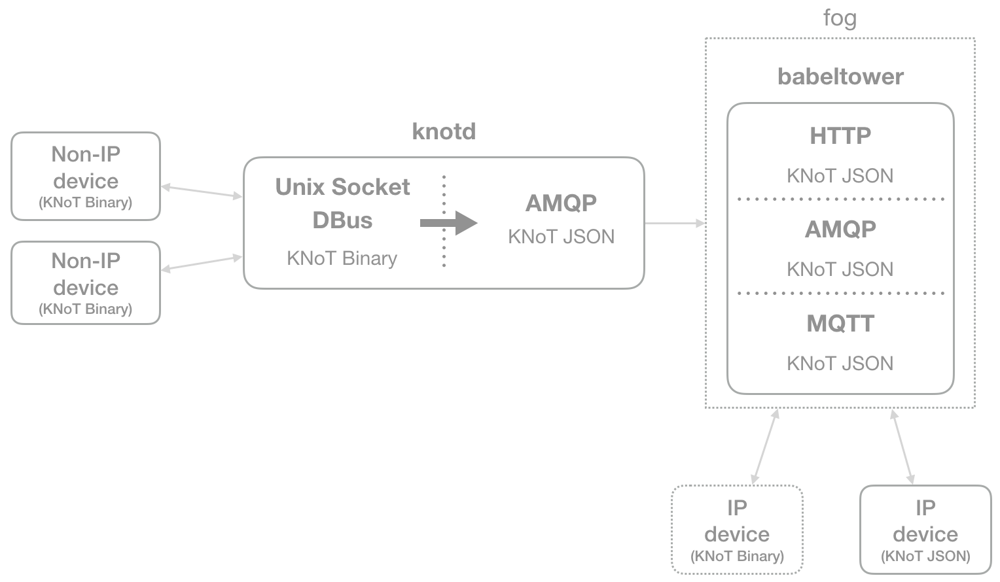

# ARC-001: Fog Architecture: Stage 1

## Status
Proposed

## Context

Until the version KNoT-v02.00, we were using the Meshblu platform as our fog computing service. However, it has presented some issues related mainly to the performance, maintainability and scalability properties. Because of that, we have decided to create a new fog architecture and use open-source projects as its building blocks. The new fog service should contain device/user management, data storage, functions, and intermittent connection support. It needs also to be lightweight and reusable.

In this context, we choose to separate the development process in stages. The decisions related to the first stage are listed in the next section.

## Decisions

What do we want to achieve in this stage?

* Things should have digital representations in the fog.
* These things should be owned by an application.
* The knotd service should be able to operate on the fog (keeping the ability to remains operating directly on the cloud if needed).
* If the device can't be registered on the cloud the connector will keep trying to register it. This will probably change when we decide about the sync mechanism (what should be proposed in another decision proposal document).

The following image illustrates the new fog architecture and its components responsibilities are described below.

    

### Responsibilities:

* **knotd**: make possible non-IP devices to communicate with the platform by receiving messages through Unix socket and DBus technologies. In this scenario, the messages are coming in a KNoT binary format and the knotd translate it to JSON, which is a format supported by the fog/cloud services. This service sends the translated messages to a message-oriented middleware that supports AMQP protocol.

* **Babeltower**: orchestrate the communication with the fog services, acting both as a proxy and a protocol translator since the internal operations can be made to services that support different application protocols. The devices that support IP connectivity can connect directly to it.

    The following image shows the relationship between the knotd and the babeltower according to the responsibilities described above.

    

        
    

* **App management**: manage the app’s accounts by providing an interface to create them and generate tokens to operate on the things. Considering the confusion when defining the difference between the developer user and the final user, we have decided to consider this service as the developer/admin user manager for now and renaming it to 'app' instead of 'user'.

* **Thing management**: manage things by providing an interface to create, remove, list and update them. This service will store the thing contextual information and any metadata that can be necessary further.
.
* **Connector**: create a bridge between the supported KNoT operations and the target cloud ones. This service defines an interface that must be implemented by a library that communicates with the integrated cloud and knows it needs.

* **WebUI**: configure the gateway components. This service provides a web interface to set the cloud configurations (including the necessary steps for that specific cloud such as associating with a gateway in the case of KNoT Cloud). Moreover, a local user is created so that the developer can log in to add or remove devices as well as to reboot, factory reset or change the gateway hostname.

## Consequences

Despite the addition of user and thing management services in this stage, we still need to discuss some important things:

- **Security**: How the KNoT will treat the device's credentials in a cloud-agnostic way? For example, the Mainflux thing's service doesn't create a token for each thing. Besides, the user's token is larger than the old KNoT user's one. We need to eliminate the coupling with the Meshblu idea and this will involve changes in the KNoT Protocol.
- **Message Queue API**: We need to define the message queue interface of the services that communicate through them (in progress).
- **Services Monitoring**: This stage will add three new services (users, things and babeltower) which will raise the need to improve its health monitoring in order to be sure they are working properly.
