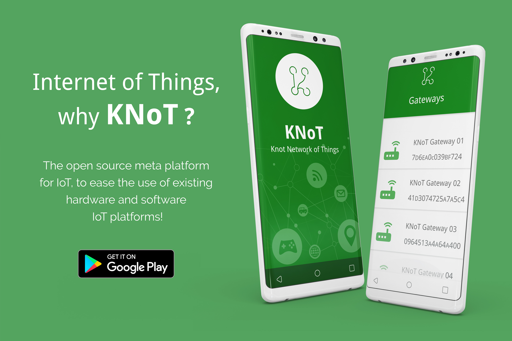

KNoT Setup App
==============

----------------------------------------------------------------

KNoT setup application is a tool capable of interacting and configuring the artifacts that are interconnected through the internet, allowing user interaction with your applications, in a practical and quick way, just by using your mobile phone.

You can get the app through google play or get the APK in this `Link <http://knot-devel.cesar.org.br/releases/v02.00>`_.

----------------------------------------------------------------

Features
--------

Device configuration
''''''''''''''''''''

Configuration of the devices with network information

The device's list
'''''''''''''''''

It provides a list of the devices connected to the user gateway.

Find the gateways
'''''''''''''''''

Identify which network your gateways are connected and get network information.

Bluetooth Device
''''''''''''''''

Identify all the devices that can be connected to the gateway through bluetooth.
