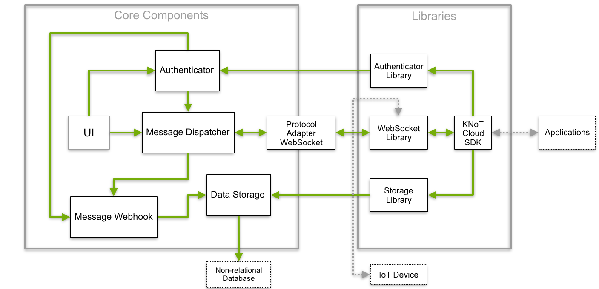

Introduction
============

What is KNoT Cloud?
-------------------

KNoT Cloud is a cloud solution developed by CESAR that aims to connect IoT devices easily and securely to a minimal messaging and management infrastructure. It supports WebSockets protocol to communicate with the core IoT services and provides APIs that lets you managing users and collecting historical data sent by the devices.

This solution makes it easy to build an IoT application that gathers, process, analyze and act on data generated by connected devices. A software development kit (`SDK <cloud-api.html>`_) is available to facilitate the application development by providing an easy to use API to the main services (device messaging, data storage and authenticator).

----------------------------------------------------------------

Features
--------

Distributed Messaging
'''''''''''''''''''''
   Built on top of Meshblu components, the KNoT Cloud can process the messages across lightweight microservices to deliver a scalable system.

Data Storage
''''''''''''
   The data sent by IoT devices are stored on a non-relational database.

Incorporated Protocol
'''''''''''''''''''''
Some KNoT protocol characteristics were brought to the cloud protocol adapters to build a reliable model layer of device representation and supports scenarios in which devices can connect directly to the cloud through the network.

----------------------------------------------------------------

Architecture
------------

The KNoT Cloud is separated by the core services and the libraries which operate on them. The message dispatcher component is responsible for process the message sent to/from devices and manage its virtual representations (CRUD capabilities). Moreover, it can send messages to the message webhook deliver to registered HTTP servers such as the data storage. The UI is used to manage apps and gateways devices. Besides, the authenticator can manage the user's devices which represents the account of how are managing the cloud. Lastly, the protocol adapter maps specific protocol operations and data models into the same ones on core services.

On the other side, the libraries abstract the complexity to the application developer by exporting a friendly API that uses the protocol adapter WebSocket under the hood. If you want to create an application, please take a look at `API Reference <cloud-api.html>`_.