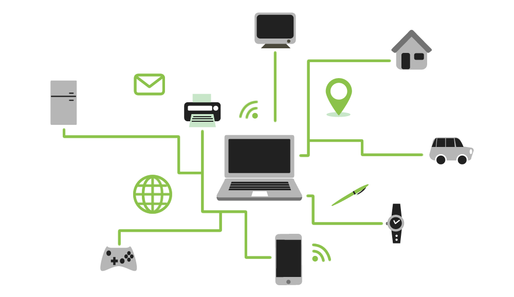
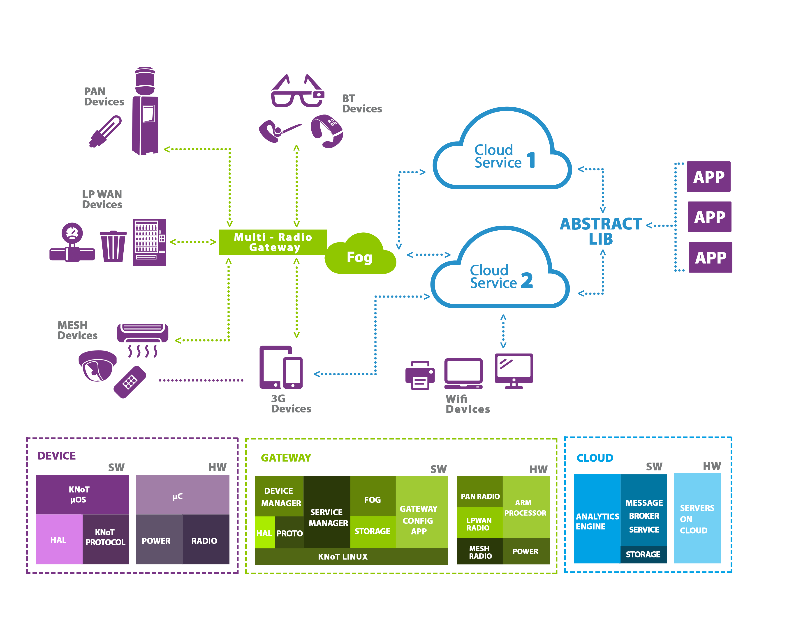

Introduction
============

Why KNoT?
---------

In the CESAR IoT Research Group vision, IoT means to embed connectivity into things, enabling it to share data and aggregate more value. As the things are different and applications so diverse, in terms of power consumption, baudrate and communication range, many standards and communication protocols will coexist, to address the specific needs of each application.

Creating a platform that implements all these different needs of things is a big effort. It requires integrating many communication protocols from all layers below the application layer, considering the OSI model. Another challenge to create an IoT platform is that IoT comprises many Computer Science areas, from embedded systems and microcontroller programming, to cloud computing, big data and analytics, passing through radio communication, network protocols, embedded operating systems, information systems, mobile and web applications.

Facing all these challenges, we decided to create KNoT. KNoT is an open source, hardware and software meta platform for IoT. It aims to bridge the gap between existing hardware and software IoT platforms, by creating a glue to easily connect and integrate them. KNoT is also multi protocol, for the physical, data link, network and transport layers, enabling each application to select the network stack that fits its needs.

----------------------------------------------------------------

Features
--------

Avoid reinventing the wheel
'''''''''''''''''''''''''''
   KNoT is a meta platform focusing on implementing the integration between existing hardware and software IoT platforms. It is focused on low cost hardware and ready to deploy software.

Open source
'''''''''''
   All KNoT software and hardware have a permissive open source license. This means that you are free to use it in your own commecial project. You are also invited to fork it and to contribute to it.

Distributed cloud
'''''''''''''''''
   KNoT implements the fog concept, where micro and local clouds receive data from the devices that are in the same place, and synchronizes it in a hierarchical way, enabling connections to millions of devices.

Semantic data model
'''''''''''''''''''
   KNoT also defines a semantic data model in the application layer. This means that all aplications in the platform know the meaning of each others data, allowing them to easily share the data.

Space-time data sharing
'''''''''''''''''''''''
   The data sharing model for the KNoT platform allows the users to share their data by time (you can access data only at monday, 2pm) and space (you can acess the data only if you are accessing it from a specific place).

From prototype to product
'''''''''''''''''''''''''
   KNoT provides all hardware designs for creating prototype and production boards, reducing the distance between concept and product. The hardware is designed focusing on mass production.

----------------------------------------------------------------

Architecture
------------

The main objective of KNoT is to create a glue to integrate hardware and software IoT platforms, focusing on low-cost hardware, and easy to use software. To achieve that, we are working on what we call KNoT Architecture 1.0, where the devices (Things) don't have direct connection to the internet, but connect to it through a Gateway, as shown in the figure.

In this architecture, the devices are comprised of a microcontroller, a power supply and an RF module. The developer can plug their sensors and actuators to this core device to create a KNoT Thing.

The KNoT Gateway acts as a proxy translating the protocol from Things to the JSON or XML that is used in the Cloud platform. It is composed of an ARM board; 3 to 4 different RF modules (sub-gigahertz radios, mesh radios, low power wide area radios, Bluetooth, etc) to connect to different Things; a power supply; ethernet connection and a custom embedded linux distribution called KNoT Linux. The Gateway also has a micro instance of the Cloud, creating a local fog where latest data from local devices can be accessed directly.

The KNoT Cloud component is responsible for collecting all the data from Gateway and acts as an entry point for the applications. It is also responsible for routing messages to applications and devices.