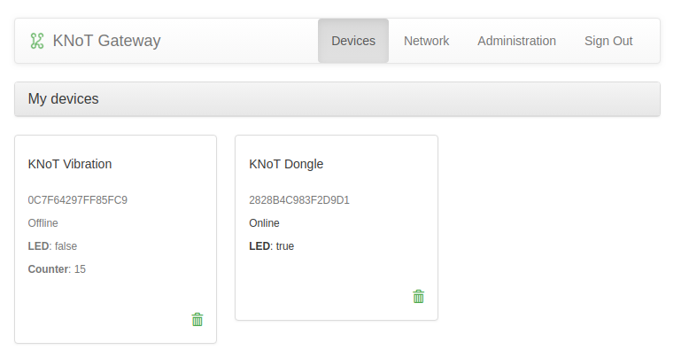

Quick Start Guide
=================

This guide will help you to set up thing's development environment, then build and run a thing application.

----------------------------------------------------------------

Configuring the KNoT Gateway
----------------------------

#. Connect the KNoT Gateway to the same network as your computer (by using an ethernet cable).

#. Access the gateway with `<http://knot.local>`_ and start the setup wizard.

   .. figure:: ../../_static/gateway_setup_wizard.png
      :scale: 70 %
      :alt: Gateway: Setup Wizard
      :align: center

#. Use the default cloud settings and proceed.

   .. figure:: ../../_static/gateway_setup_cloud.png
      :scale: 50 %
      :alt: Gateway: Cloud setup
      :align: center

#. Create your KNoT Cloud user and sign in to it.

   .. figure:: ../../_static/gateway_setup_signin.png
      :scale: 70 %
      :alt: Gateway: Sign in to cloud
      :align: center

#. Create a new gateway at the cloud and name it.

   .. figure:: ../../_static/gateway_setup_name.png
      :scale: 70 %
      :alt: Gateway: Create new gateway
      :align: center

#. Wait for the gateway to reboot.

#. Log in with the email and password you just signed up at `KNoT Cloud <https://knot.cloud>`_.

   .. figure:: ../../_static/gateway_signin.png
      :scale: 70 %
      :alt: Gateway: Sign in
      :align: center

   .. note:: As there are no KNoT Things connected to your gateway, the message `"No nearby devices found."` will be displayed

----------------------------------------------------------------

Thing's Development Environment
-------------------------------
In order to compile and flash applications for the KNoT Thing, it's necessary to set up the development environment.

The fastest way to do it is by using a pre-built Docker image.

#. Download and install `Docker <https://docs.docker.com/install/>`_.

#. In a terminal, get the latest KNoT Thing SDK Docker environment image.

   .. code-block:: bash

      docker pull cesarbr/knot-zephyr-sdk:latest

.. note:: Docker is only available for Linux based systems, macOS 10.11+ and Windows 10 Pro/Enterprise.

----------------------------------------------------------------

Programming the KNoT Thing
--------------------------

Compiling project
'''''''''''''''''

#. Clone the `zephyr-knot-sdk repository <https://github.com/CESARBR/zephyr-knot-sdk>`_ to your home folder.

   .. code-block:: bash

      git clone https://github.com/CESARBR/zephyr-knot-sdk.git ~/zephyr-knot-sdk

#. Navigate to the application project directory.

   .. code-block:: bash

      cd ~/zephyr-knot-sdk/apps/hello-dongle

#. Run environment image.

   .. code-block:: bash

      docker run -ti -v $(pwd)/:/workdir cesarbr/knot-zephyr-sdk:latest

#. From the container, build the project for the target board.

   - If using the `KNoT DK <https://docs.zephyrproject.org/latest/boards/arm/nrf52840_pca10056/doc/index.html>`_:

      .. code-block:: bash

         [user@container] $ knot make --board dk

   - If using the `KNoT Dongle <https://docs.zephyrproject.org/latest/boards/arm/nrf52840_pca10059/doc/index.html>`_:

      .. code-block:: bash

         [user@container] $ knot make --board dongle

Flashing board
''''''''''''''

#. From your project folder, export the generated files to a ``output`` folder.

   .. code-block:: bash

      [user@container] $ knot export output/

#. Install `nRF Connect <https://www.nordicsemi.com/Software-and-Tools/Development-Tools/nRF-Connect-for-desktop/Download>`_.

#. Open *nRF Connect* and add the *Programmer App*.

   .. figure:: ../../_static/nrfconnect_add_programmer.png
      :scale: 70 %
      :alt: nRF Connect: Add Programmer
      :align: center

#. Launch the *Programmer App*.

   .. figure:: ../../_static/nrfconnect_launch_programmer.png
      :scale: 70 %
      :alt: nRF Connect: Launch Programmer
      :align: center

#. Connect the device to a USB port.

   .. tip:: If using the `KNoT Dongle <https://docs.zephyrproject.org/latest/boards/arm/nrf52840_pca10059/doc/index.html>`_, press the *RESET* button to get into DFU mode.
      The red LED will start to blink.

#. Select the target device.

   .. figure:: ../../_static/nrfconnect_select_device.png
      :scale: 70 %
      :alt: nRF Connect: Select device
      :align: center

#. Define the HEX file to be flashed.

   Click **Add HEX file** and select the ``boot_sgn_apps.hex`` file that was exported to the ``output/`` folder.

   .. figure:: ../../_static/nrfconnect_add_hex.png
      :scale: 70 %
      :alt: nRF Connect: Add HEX file
      :align: center

   .. note:: The path for the hex file should be ``~/zephyr-knot-sdk/apps/hello-dongle/output/boot_sgn_apps.hex``.

#. Flash the project.

   Click **Write** and wait for the board to be flashed. The red LED will stop blinking for the Dongle.

----------------------------------------------------------------

Configuring the Thing network
-----------------------------

In this section we are going to configure the Thing to automatically connect to the Gateway mesh network.

#. Make sure that the device Thing is on the `Setup Mode`, indicated by the alternating LEDs.

   .. figure:: ../../_static/dongle_setup.gif
      :scale: 130 %
      :alt: KNoT Dongle: Setup mode
      :align: center

      KNoT Dongle: Setup mode

   .. figure:: ../../_static/dk_setup.gif
      :scale: 70 %
      :alt: KNoT DK: Setup mode
      :align: center

      KNoT DK: Setup mode

#. Download the `mobile KNoT Setup App <https://knot-devel.cesar.org.br/releases/latest/knot_setup_app.apk>`_ and install it to your smartphone (Android only).

#. Connect your smartphone to the same Wi-Fi network that you connected your Gateway to.

#. Open the KNoT Setup App, and select your gateway under the *Connected* tab

   .. figure:: ../../_static/android_gateways_connected.png
      :scale: 20 %
      :alt: Setup App: Connected Gateways
      :align: center

#. Login with your user credentials

   .. figure:: ../../_static/android_gateway_login.png
      :scale: 20 %
      :alt: Setup App: Gateway login
      :align: center

#. Select the target Thing under the *Unregistered* tab

   .. figure:: ../../_static/android_things_unregistered.png
      :scale: 20 %
      :alt: Setup App: Unregistered Things
      :align: center

#. Wait for the OpenThread configurations to be transferred.

   .. figure:: ../../_static/android_ot_settings.png
      :scale: 20 %
      :alt: Setup App: OpenThread settings
      :align: center

#. Power off and on the KNoT Thing.

----------------------------------------------------------------

See connected Things
--------------------

If all the steps were followed correctly, it will be possible to see that the KNoT Thing is connected to the target Gateway.

To do so:

#. Access the gateway web page with `<http://knot.local>`_.

#. Login with your user credentials.

#. Look for your connected thing and see the value being updated.

----------------------------------------------------------------

KNoT Cloud SDK
--------------

To interact with data from device, utilize KNoT Cloud SDK to construct a User Application.
