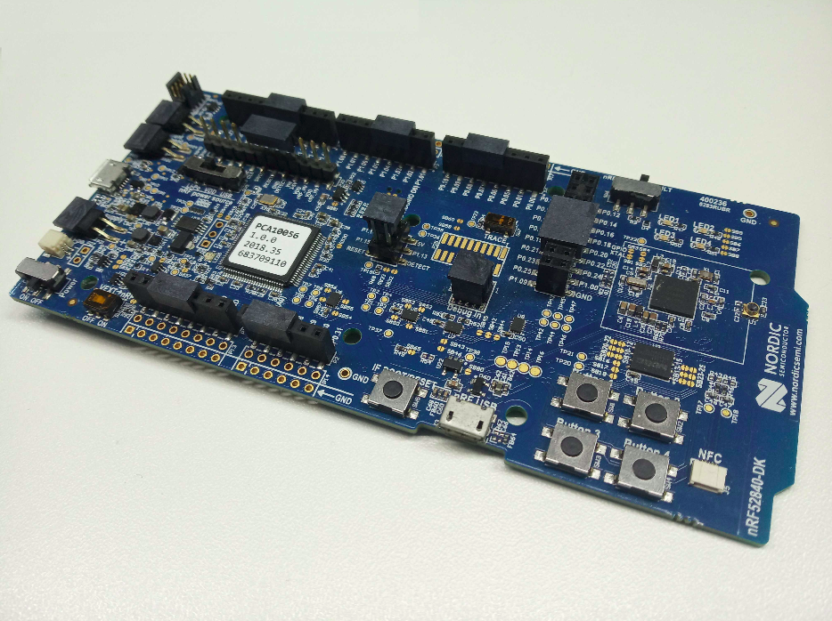
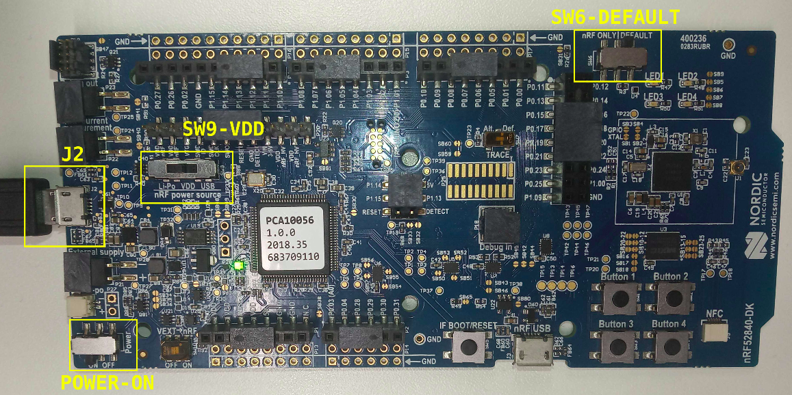

KNoT DK
=======

Overview
--------

The KNoT DK (nRF52840-PCA10056) is manufactured by Nordic Semiconductor and it
has features such as:

   - User programmable Buttons and LEDs
   - IO interface for Arduino form factor
   - Debug out functionality
   - NFC Support

   DK - nRF52840 (PCA10056)

More information about the board can be found at the `nRF52840 DK website
<https://www.nordicsemi.com/Software-and-Tools/Development-Kits/nRF52840-DK>`_
and `Zephyr nRF52840-PCA10056 website
<https://docs.zephyrproject.org/latest/boards/arm/nrf52840_pca10056/doc/index.html>`_.
The `Nordic Semiconductor Infocenter
<https://infocenter.nordicsemi.com/topic/ug_nrf52840_dk/UG/nrf52840_DK/intro.html>`_
contains the processor's information and the datasheet.

-------------------------------------------------------------------------------

Supported Features
------------------

The DK hardware provides support for the following devices:

   - ADC
   - CLOCK
   - FLASH
   - GPIO
   - I2C
   - MPU
   - NVIC
   - PWM
   - RTC
   - Segger RTT
   - SPI
   - UART
   - USB
   - WDT

-------------------------------------------------------------------------------

Connections and IOs
-------------------

.. warning:: The reserved buttons and LEDs should not be controlled by the user.

Buttons
'''''''

+-------+------------+---------------+---------------+------------+
| Part  | Name       | Description   | Pin           | Permission |
+=======+============+===============+===============+============+
| SW1   | Button 1   | Factory Reset | P0.11 / P1.07 | Reserved   |
+-------+------------+---------------+---------------+------------+
| SW2   | Button 2   | Application   | P0.12 / P1.08 | Available  |
+-------+------------+---------------+---------------+------------+
| SW3   | Button 3   | Application   | P0.24         | Available  |
+-------+------------+---------------+---------------+------------+
| SW4   | Button 4   | Application   | P0.25         | Available  |
+-------+------------+---------------+---------------+------------+
| SW5   | Boot/Reset | Reboot        |               | Reserved   |
+-------+------------+---------------+---------------+------------+

LEDs
''''

+-------+-------------+-------+-------+---------------+------------+
| Part  | Description | Color | Pin   | Solder bridge | Permission |
+=======+=============+=======+=======+===============+============+
| LED 1 | Status      | Green | P0.13 | SB5           | Reserved   |
+-------+-------------+-------+-------+---------------+------------+
| LED 2 | Application | Green | P0.14 | SB6           | Available  |
+-------+-------------+-------+-------+---------------+------------+
| LED 3 | Application | Green | P0.15 | SB7           | Available  |
+-------+-------------+-------+-------+---------------+------------+
| LED 4 | Application | Green | P0.16 | SB8           | Available  |
+-------+-------------+-------+-------+---------------+------------+

Analog Input
''''''''''''

+-------+----------------+-------+------------+
| Name  | Arduino Naming | Pin   | Permission |
+=======+================+=======+============+
| AIN 0 | Unavailable    | P0.02 | Available  |
+-------+----------------+-------+------------+
| AIN 1 | A0             | P0.03 | Available  |
+-------+----------------+-------+------------+
| AIN 2 | A1             | P0.04 | Available  |
+-------+----------------+-------+------------+
| AIN 3 | Unavailable    | P0.05 | Available  |
+-------+----------------+-------+------------+
| AIN 4 | A2             | P0.28 | Available  |
+-------+----------------+-------+------------+
| AIN 5 | A3             | P0.29 | Available  |
+-------+----------------+-------+------------+
| AIN 6 | A4             | P0.30 | Available  |
+-------+----------------+-------+------------+
| AIN 7 | A5             | P0.31 | Available  |
+-------+----------------+-------+------------+

-------------------------------------------------------------------------------

Flash instructions
------------------

To flash the KNoT DK connect a USB cable between KNoT DK and a PC using the J2
connector and turn the power switch ``ON``. Make sure the SW9 switch is on
``VDD`` and the SW6 switch is on ``DEFAULT`` position. Use nRF Connect or `KNoT
CLI <../thing-cli.html#flash-board-when-done>`_ to flash the
image on your board.

   Position of switches to flash KNoT DK

-------------------------------------------------------------------------------

Suggested examples
------------------

The suggested samples using peripherals are listed as following.

   - `blink <../samples/basic-samples/blink.html>`_
   - `analog-alert <../samples/sensor-samples/analog-alert.html>`_
   - `digital-counter <../samples/sensor-samples/digital-counter.html>`_
