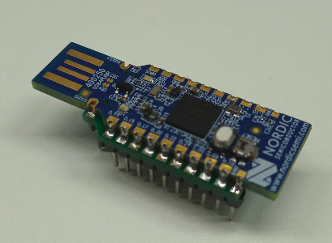
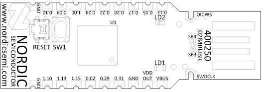
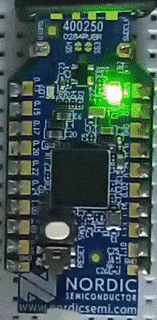

KNoT Dongle
===========

Overview
--------

The KNoT Dongle (nRF52840-PCA10059) is a low-cost board manufactured by Nordic
Semiconductor and it has a user programmable RGB LED.

   Dongle - nRF52840 (PCA10059)

More information about the board can be found at the `nRF52840 Dongle website
<https://www.nordicsemi.com/Software-and-Tools/Development-Kits/nRF52840-Dongle>`_
and `Zephyr nRF52840-PCA10059 website
<https://docs.zephyrproject.org/latest/boards/arm/nrf52840_pca10059/doc/index.html>`_.
The `Nordic Semiconductor Infocenter
<https://infocenter.nordicsemi.com/topic/ug_nrf52840_dongle/UG/nrf52840_Dongle/intro.html>`_
contains the processor's information and the datasheet.

-------------------------------------------------------------------------------

Supported Features
------------------

The Dongle hardware provides support for the following devices:

   - ADC
   - CLOCK
   - FLASH
   - GPIO
   - I2C
   - MPU
   - NVIC
   - PWM
   - RTC
   - SPI
   - UART
   - USB
   - WDT

-------------------------------------------------------------------------------

Connections and IOs
-------------------

   Dongle - Connections and IOs (Credit: Nordic Semiconductor)

.. warning:: The reserved buttons and LEDs should not be controlled by the user.

Buttons
'''''''

+-------+---------------+--------+------------+
| Part  | Description   | Pin    | Permission |
+=======+===============+========+============+
| SW1   | Factory Reset | P1.06  | Reserved   |
+-------+---------------+--------+------------+
| RESET | Reset         | P0.18  | Reserved   |
+-------+---------------+--------+------------+

LEDs
''''

+------+-------------+-------+-------+------------+
| Part | Description | Color | Pin   | Permission |
+======+=============+=======+=======+============+
| LD1  | Status      | Green | P0.06 | Reserved   |
+------+-------------+-------+-------+------------+
| LD2  | Application | Red   | P0.08 | Available  |
+      +             +-------+-------+            +
|      |             | Green | P1.09 |            |
+      +             +-------+-------+            +
|      |             | Blue  | P0.12 |            |
+------+-------------+-------+-------+------------+

Analog Input
''''''''''''

+-------+-------+------------+
| Name  | Pin   | Permission |
+=======+=======+============+
| AIN 0 | P0.02 | Available  |
+-------+-------+------------+
| AIN 5 | P0.29 | Available  |
+-------+-------+------------+
| AIN 7 | P0.31 | Available  |
+-------+-------+------------+

-------------------------------------------------------------------------------

Flash instructions
------------------

To flash the Dongle is necessary to enter the bootloader mode by pressing
the RESET button. The red LED (LD2) should start a fade pattern when the
bootloader starts running. Use nRF Connect or KNoT CLI to flash the image to
your board.

   Reset button used to enter DFU mode.

-------------------------------------------------------------------------------

Suggested examples
------------------

The suggested samples using peripherals are listed as following.

   - `blink <../samples/basic-samples/blink.html>`_
   - `analog-alert <../samples/sensor-samples/analog-alert.html>`_
   - `digital-counter <../samples/sensor-samples/digital-counter.html>`_
