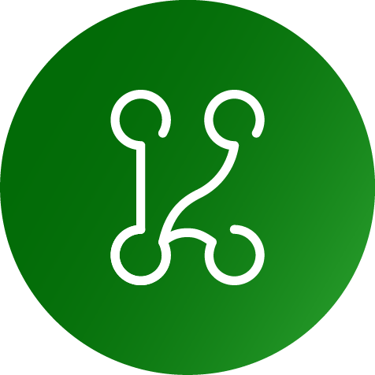

----------------------------------------------------------------

.. centered:: KNoT Network Of Things

.. centered:: the open source meta platform for IoT

It aims to ease the use of existing hardware and software IoT platforms, and is constructed on top of them.

----------------------------------------------------------------

Welcome to KNoT's documentation!
================================

Sections:
---------

.. toctree::
   :maxdepth: 1

   doc/general/introduction
   doc/quick-start/qs-guide
   doc/cloud/cloud
   doc/gateway/gateway
   doc/thing/thing
   doc/app-setup/app-setup
   doc/general/source_code
   doc/general/contact

.. Indices and tables
.. ==================

.. * :ref:`genindex`
.. * :ref:`modindex`
.. * :ref:`search`

Powered by:

